# Labyrintgenerator
*(Bidrag till kodboken.se)*

Vårt uppdrag är att skriva en labyrintgenerator i Scratch. Man ska kunna välja bredd och höjd på labyrinten, som ska vara rektangulär.

Det ska gå att ta sig mellan labyrintens fyra hörn. Labyrinten ska se olika ut från gång till gång.

En labyrintgenerator kan man ha nytta av i olika spel. Därför är det bra om vi har några få sprajtar som man kan importera med ryggsäcken.

Så här kan det se ut när vi är klara:

Låter det krångligt? Vi tar ett steg i taget. Jag har formulerat en önskelista som kanske kan hjälpa.

## Önskan 1. Det går att välja bredd och höjd på labyrinten

Den här önskan kan vi uppfylla genom att katten frågar om bredd och höjd. Vi sparar svaren i variablerna `BREDD` och `HÖJD`.

Pröva nu att göra en lösning på egen hand innan du går vidare.

### Ledtrådar

Här är några block som kan vara bra att ha:

### Lösningsförslag
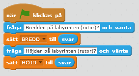

Än så länge är det bara katten som frågar. Ingen labyrint syns än.

Jag har valt STORA BOKSTÄVER för variabler som används av flera block. Ett exempel är variabeln `BREDD`. Sådana globala variabler kan ge programfel som är svåra att hitta. Därför sätts deras värden bara en gång.

Variabler med små bokstäver används inom ett block.
 
### Förbättringsidéer

1. Behöver vi kontrollera indata bättre? Vad är rimliga värden på variablerna `BREDD` och `HÖJD`?

## Önskan 2. Det syns ett rutnät
Vi vill att det ser ut något i den här stilen om vi svarar `BREDD` 5 och `HÖJD` 3.

Om vi pekar med muspekaren på scenen så ser vi att Scratch har ett koordinatsystem där `X` går från &ndash;240 till 240 och `Y` går från &ndash;180 till 180. Våra yttersta prickar behöver ligga en liten bit in från kanten så att de syns. Jag har därför använt variablerna
`XSTART`,
`YSTART`,
`XSLUT` och
`YSLUT` som du kan se i bilden. Jag satte t.ex. `XSTART` till &ndash;230 för att hålla mig en bit från vänsterkanten. Genom att använda variabler och inte skriva t.ex. &ndash;230 direkt i koden kan jag justera storleken enkelt om det behövs.

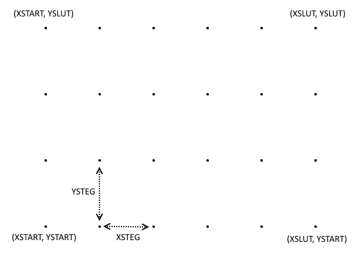
 
Med 5&times;3 rutor (bredd&times;höjd) behövs det ju sex hörnprickar på bredden och fyra på höjden. Avståndet mellan ytterhörnen på bredden är `XSLUT`&ndash;`XSTART` pixlar och genom att dividera med `BREDD` får vi antalet pixlar mellan hörnprickarna. Vi kallar det avståndet `XSTEG`. Se bilden, där `YSTEG` också visas.

### Ledtrådar

* Det kan vara bra att dela upp koden i flera block. Tänk på att du kan skapa egna block. Ett användbart block kan vara

där B är bredden och H höjden. Det nedre vänstra hörnet kan t.ex. vara (B, H) = (0, 0) och övre högra hörnet (B, H) = (`BREDD`, `HÖJD`).

* Ändra gärna koden som du skrev i steg 1. Det är viktigt att skriva om kod som inte passar längre.

* Hörnprickarna kanske kan vara en ny klädsel hos katten? Då slipper vi skapa en ny sprajt.

* Några block som kan vara bra att ha:

### Lösningsförslag

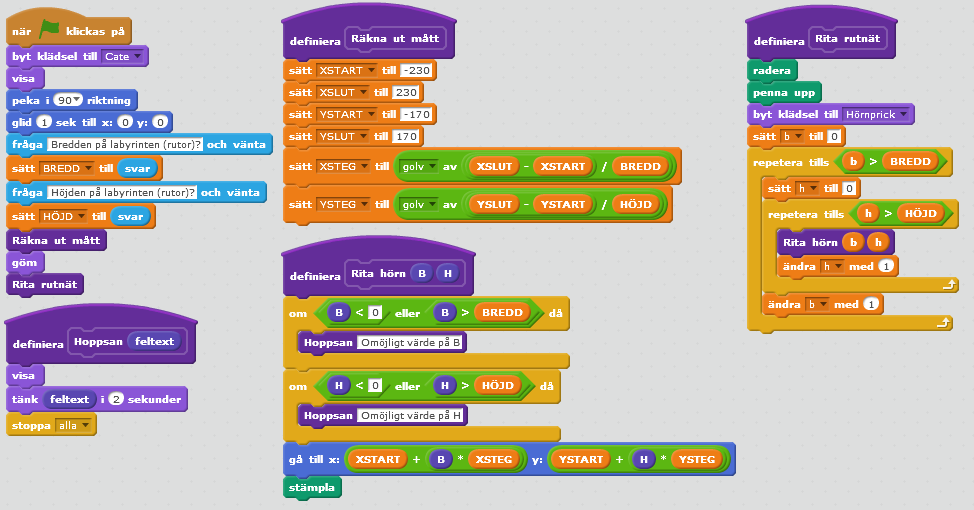

### Förbättringsidéer

## Önskan 3. Det finns en yttervägg

Så här kan det se ut när vi är klara:

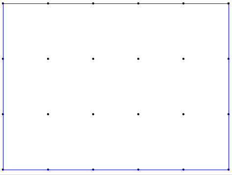

Det är fyra ytterväggar att rita. Kan du dela upp jobbet i mindre delar?

### Ledtrådar
* Det kan vara praktiskt att ha ett block för att rita en vägg med olika startpunkt och riktning.

* Har vi ett block för att rita en vägg så kan vi använda det fyra gånger för de olika väggarna.

### Lösningsförslag

Här ser du de block som jag har lagt till eller ändrat. Resten är som innan.

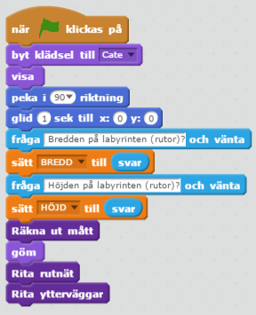
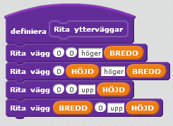
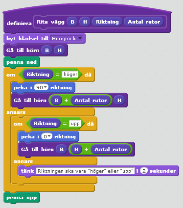

### Förbättringsidéer

## Önskan 4. Det finns innerväggar och man kan gå mellan labyrintens hörn
Här är vi nu om vi svarar `BREDD` 6 och `HÖJD` 4:

Det behövs innerväggar för att det ska bli en intressant labyrint. Men innerväggarna kan inte ritas hur som helst om vi vill kunna gå genom labyrinten.

Kan de här två reglerna fungera?
* Regel 1. En rektangel kan delas i två mindre rektanglar om vi ritar en rak innervägg som har ett hål någonstans.
* Regel 2. Vi kör regel 1 på de två mindre rektanglarna tills vi får så små rektanglar att de har bredd eller längd 1, alltså formen av en korridor.

Regel 1 gör att vi alltid kan komma igenom på ett ställe i labyrinten. 

Regel 1 och 2 tillsammans hjälper oss att bryta ner problemet i flera mindre bitar. När bitarna är tillräckligt små är vi färdiga.

Så här kan det se ut. Siffrorna 1 och 2 visar var vi använder regel 1 och 2:

 

Vi ritade en horisontell vägg med ett hål på ett slumpmässigt ställe.

Nu upprepar vi två gånger och får något i den här stilen:

 
 

Våra två regler verkar fungera och i nästa steg ska vi förbättra labyrinten.

### Ledtrådar
Vi behöver ett sätt att hålla reda på vilka rektanglar vi jobbar med. Kanske en listvariabel kan hjälpa till? De här blocken kan vara bra att känna till:

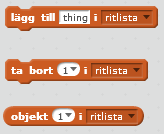 

### Lösningsförslag

Variabeln `ritlista` håller reda på alla rektanglar där vi ska rita innerväggar. Varje rektangel motsvaras av fyra värden i listan: `b`, `h` för nedre vänstra hörnet, `b1`, `h1` för övre högre hörnet i rektangeln.

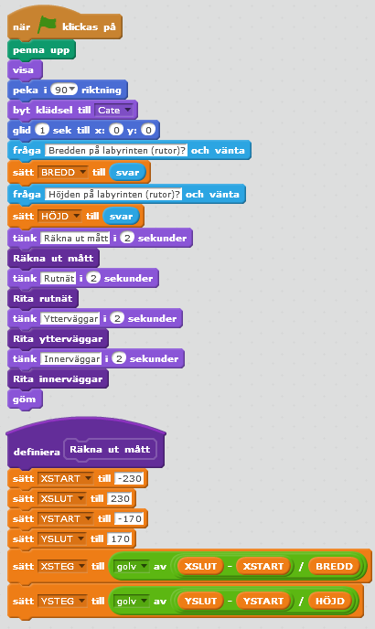
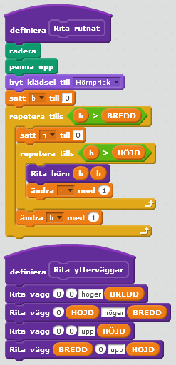
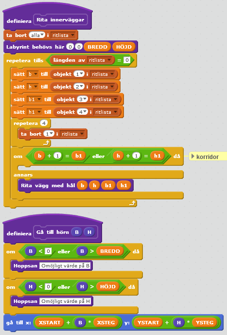
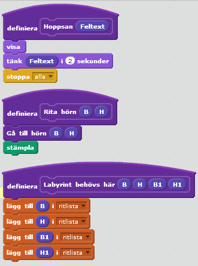

## Önskan 5. Väggarna delar sig horisontellt eller vertikalt, inte bara horisontellt som i nr 4

### Ledtrådar
* De här blocken kan komma till användning: &hellip;
* Ändra i funktionen *Rita vägg med hål* så att den ibland delar vertikalt istället för bara horisontellt
* Bild som illustrerar

### Lösningsförslag

